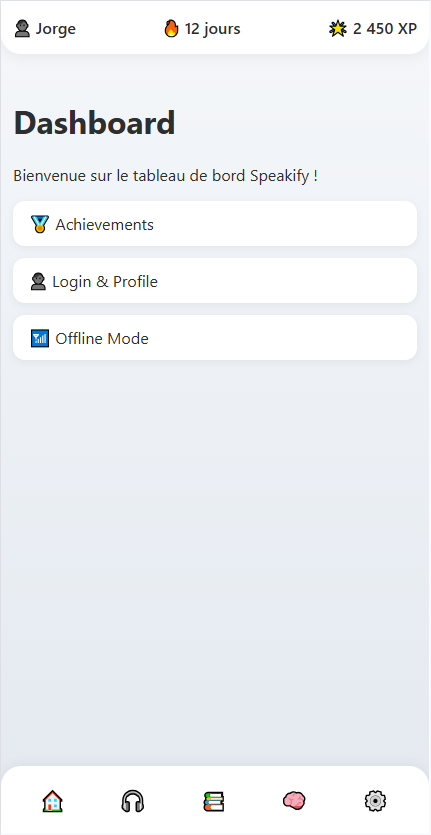

## 📄 Documentation

-    [Readme](https://github.com/BlackSheep-78/speakify/blob/main/README.md)

- 🇫🇷 [Cahier des Charges (FR)](https://github.com/BlackSheep-78/speakify/blob/main/docs/statement_of_work.fr.md)  
- 🇬🇧 [Statement_of_Work  (EN)](https://github.com/BlackSheep-78/speakify/blob/main/docs/statement_of_work.en.md)
  
- 🇫🇷 [Document de Spécifications Techniques (FR)](https://github.com/BlackSheep-78/speakify/blob/main/docs/technical_specification_document.fr.md)  
- 🇬🇧 [Technical Specification Document (EN)](https://github.com/BlackSheep-78/speakify/blob/main/docs/technical_specification_document.en.md)

---

# Speakify - Statement of work

## 1. Introduction  
### 1.1 Project Overview  
Speakify is an interactive language learning platform that enables users to engage with multilingual audio content through structured playlists. The platform allows users to create and manage custom translation-based audio experiences, making language acquisition more immersive and effective. Speakify is designed for accessibility across mobile, desktop, and TV screens.

### 1.2 Objectives  
- Provide a structured approach to language learning through **Playback Loops (PLs)**.  
- Enable users to create, manage, and customize **playlists** with various learning modes.  
- Ensure a seamless user experience across multiple devices.  
- Support multiple languages and translations with audio playback.  
- Offer a scalable backend for efficient storage and retrieval of translations.  
- Develop and deploy within the time frame of **March 25 to April 23, 2025**.

---

## 2. Features & Problem Solving  
### **2.1 Application Features**  
- **Multilingual Audio Playlists**: Users can create and customize playlists consisting of Playback Loops with audio files.  
- **Playback Loops (PLs)**: A structured unit that contains a sentence in a source language and its equivalent translations in multiple languages, each with an associated audio file.  
- **Customizable Playback Schema**: Users can define the playback sequence, repetitions, and timing of Playback Loops.  
- **Cross-Device Compatibility**: Designed to work on mobile phones, desktops, and TVs for a flexible learning experience.  
- **Interactive Learning**: Features like loop mode, adjustable playback speed, and pronunciation practice help reinforce learning.  
- **Intensive Learning Mode**: Allows users to engage in focused and repetitive drills with accelerated playback and adaptive difficulty to enhance retention and fluency.  
- **Offline Support** (Planned): Ability to store translations and audio for offline use.  
- **User Playlists Management**: Create, edit, and organize language learning sessions according to personal learning needs.  
- **Playlists by Difficulty & Context**: Users can categorize playlists based on difficulty levels and specific contexts, such as professional vocabulary for various industries.  
- **Learn on the Go**: Ideal for users who want to learn while walking, running, commuting on the bus or car, or even while working. Designed for people who have limited time to study.  
- **Support for Immigrants**: Provides an accessible way for immigrants to quickly learn and adapt to a new language environment.  
- **Future Expansion**: Potential for integration with AI-powered translation services.  
- **Translation Pertinence Control**: **Users can increase or decrease the pertinence level of a translation, affecting how frequently it is displayed during playback.**  
- **Schema Based on Pertinence**: **Users can apply different playback schemas based on pertinence levels to prioritize or de-emphasize certain translations.**  
- **Smart Lists**:  
  - **Target Word Context Lists**: **Lists of sentences that include a specific word, providing real-world usage examples.**  
  - **Verb Conjugation Lists**: **Lists of sentences using specific verbs in various conjugations and tenses.**  
  - **Context-Based Lists**: **Playlists targeting specific circumstances (e.g., airport, hospital, restaurant).**  
  - **Random Sentences**: **Automatically generated lists to expose learners to a wide variety of structures and vocabulary.**  
  - **Dialogues**: **Playlists simulating real conversations to enhance comprehension and engagement.**  
  - **Stories**: **Narrative-based playlists to promote natural learning through contextual immersion.**  
  - **Word of the Day Lists**: **Each day, Speakify suggests a new word or verb. Users can access a list of sentences that include the word of the day in real contexts, enhancing vocabulary through daily exposure.**

### 2.2 Target Audience  
- **Language Learners**: Individuals looking to learn or improve a new language through structured listening.  
- **Educators & Tutors**: Teachers who want to create custom language exercises for their students.  
- **Multilingual Professionals**: Business professionals who need to master multiple languages for communication.  
- **Industry-Specific Learners**: Individuals looking to learn domain-specific vocabulary, such as medical, legal, or technical terminology.  
- **Travelers & Expats**: People relocating to a new country who need practical, real-world language exposure.  
- **Speech & Hearing Specialists**: Researchers and professionals working with multilingual content for language studies.  
- **Busy Professionals & Workers**: People who have limited time for formal study but want to learn through passive listening.  
- **Immigrants & New Residents**: Individuals who need to learn a new language quickly for adaptation and daily interactions.

---

Perfect, Jorge. Here's your clean **Section 3 – Navigation & Wireframes** snippet, ready to copy-paste into your markdown document (VS Code, Notion, or anywhere else):

---

```markdown
## 3. Navigation & Wireframes

### 3.1 User Flow Diagram

```plaintext
Start App
   ↓
[🏠 Dashboard]
   ├── "Start New Session"   → [🎧 Player]
   ├── "Recent Playlist"     → [🎧 Player]
   ├── "Daily Word"          → [🧠 Smart Lists > Word of the Day]
   └── "Playlists"           → [📚 Playlist Library]

[📚 Playlist Library]
   ├── "View Playlist"       → [🎧 Player]
   ├── "+ Create Playlist"   → [✏️ Playlist Editor]
   │     └── "Assign Schema" → [🛠 Schema Selector] or [➕ Create New Schema]
   └── "Edit Schema"         → [🛠 Schema Editor]

[🛠 Schema Editor]
   ├── Define Playback Order (e.g., EN → FR → Pause → Repeat)
   ├── Set Repetitions per segment
   ├── Adjust Delay / Speed
   └── Save Schema

[🧠 Smart Lists]
   ├── Word of the Day        → Contextual Sentences
   ├── Verb Conjugations      → Sentences with verb variations
   ├── Thematic Contexts      → e.g., Airport, Restaurant
   ├── Dialogues / Stories    → Contextual audio conversations

[🎧 Player]
   └── Controls: Play, Pause, Loop, Next, Previous, Speed

[⚙️ Settings]
   ├── Audio Speed
   ├── Language Preferences
   └── Offline Mode Options

[🔐 Login (Optional)]
   └── Sync Data, Save Profile, Enable Cloud Features
```

---

### 3.2 Wireframes (Low-Fidelity)

#### 🎧 **Playback View**

```plaintext
┌──────────────────────────────────────────────┐
│ 👤 Jorge     🔥 12 Days     🌟 2,450 XP       │   ← Header
├──────────────────────────────────────────────┤
│ ▶ Hello (EN)      → Bonjour (FR)             │
│ ⏸ Pause   🔄 Repeat x3                       │   ← Active Sentence
├──────────────────────────────────────────────┤
│ 🔽 Sentence 2 (FR)                            │
│ 🔽 Sentence 3 (FR)                            │   ← Queued Sentences
├──────────────────────────────────────────────┤
│ 🏠  🎧  📚  🧠  ⚙️                               │   ← Bottom Navigation
└──────────────────────────────────────────────┘
```

---

### 3.3 UI Screens (MVP Roadmap)

| View                   | Status   | Description                                       |
|------------------------|----------|---------------------------------------------------|
| Playback View          | ✅ Done  | Audio playback with translation sequence         |
| Schema Editor View     | 🔜 Next  | Create and customize playback logic              |
| Playlist Library View  | 🔲 Todo  | Search, browse, and manage playlists             |
| Playlist Editor View   | 🔲 Todo  | Create & assign schemas to playlists             |
| Smart Lists View       | 🔲 Todo  | Auto-generated lists (verbs, contexts, etc.)     |
| Settings View          | 🔲 Todo  | Speed, language, offline controls                |

---

### 🔮 Extra Features (Planned)

| Feature                    | Status |
|----------------------------|--------|
| Word of the Day View       | 🔲     |
| Login & Profile View       | 🔲     |
| Achievements & Stats View  | 🔲     |
| Offline Mode View          | 🔲     |

---

## 4. Graphical Identity (UI/UX Design)

Speakify aims to deliver a clear, immersive, and consistent visual experience across all devices — mobile, desktop, and TV. The design system prioritizes readability, focus, and user-friendliness to support long-term engagement and effective language learning.

---

### 4.1 Color Scheme & Visual Identity

| Purpose        | Color Name      | Hex Code  | Notes                                       |
|----------------|------------------|-----------|---------------------------------------------|
| Primary        | Deep Blue        | #0057B7   | Trust, calmness, and focus on learning      |
| Accent         | Electric Green   | #00E676   | Highlights important actions (e.g., Play)   |
| Background     | Light Gray       | #F5F7FA   | Neutral, reduces eye strain                 |
| Surface        | Soft White       | #FFFFFF   | Card and container backgrounds              |
| Text Primary   | Charcoal Black   | #2E2E2E   | High contrast, legible across screens       |
| Alert / Error  | Coral Red        | #FF5252   | For deletions, errors, or critical alerts   |

The interface remains predominantly calm and neutral, using vibrant colors only for essential feedback and interactive elements.

---

### 4.2 Typography

Speakify uses clean, modern, and readable fonts optimized for accessibility and multilingual content.

| Use Case      | Font                  | Fallbacks              |
|---------------|------------------------|------------------------|
| Headings      | Segoe UI Bold          | system-ui, sans-serif  |
| Body Text     | Segoe UI Regular       | Helvetica, Arial       |
| UI Highlights | Antipasto Pro (Light)  | Segoe UI               |

Fonts are chosen for their cross-platform availability and aesthetic harmony. All text is responsive and mobile-optimized.

---

### 4.3 UI Components & Layout

- **Buttons**: Rounded (border-radius 12px+), vibrant on hover, clean contrast.
- **Cards & Containers**: Soft drop shadows, consistent padding, neutral backgrounds.
- **Navigation**: Bottom tab navigation on mobile; top nav or side panel on desktop.
- **Icons**: Modern icon libraries (Lucide, Tabler, or Material Symbols).
- **Animations**: Light transitions only for feedback (e.g., active block expansion).
- **Dark Mode**: Planned as an optional setting for comfort during night use.

---

### 4.4 Consistency Across Devices

Speakify is designed as a **responsive progressive web app (PWA)** with consistent behavior and UI structure across:

- 📱 **Mobile phones**: Thumb-friendly controls, bottom navigation
- 💻 **Desktops/Laptops**: Scalable layout with larger reading zones
- 📺 **TVs / Smart Displays**: Large text, high contrast, minimal controls

Grid-based layout, shared styles, and reusable components ensure a unified experience regardless of screen size or input method.

---


---

## 5. Eco-Responsibility

Speakify is committed to sustainable digital practices. As a modern, web-based language learning platform, it will be designed with eco-responsibility in mind — optimizing for low energy consumption, reduced data transfer, and efficient use of resources across devices.

---

### 5.1 Server Efficiency Considerations
To reduce the platform’s environmental footprint, Speakify will prioritize:

- **Lightweight backend services**: Optimized APIs that serve only essential data.
- **Efficient database queries**: Cached lookups and pagination to reduce server load.
- **Green hosting options**: Preference for providers using renewable energy (e.g., Infomaniak, Scaleway Green).
- **Auto-scaling infrastructure**: Dynamic resource allocation based on demand, avoiding overprovisioning.

---

### 5.2 Low-Bandwidth Optimization
The frontend will be designed to work efficiently even in low-speed or unstable networks, especially for mobile users and global learners.

- **Lazy-loading** of images, audio, and large assets.
- **Adaptive streaming** for audio files (lower bitrate for slow networks).
- **Compressed assets** using WebP, Brotli, and modern web formats.
- **Minimal third-party scripts** to reduce bandwidth waste.

---

### 5.3 Offline Mode Enhancements
Speakify’s offline mode supports both eco-responsibility and accessibility for users with limited or costly data plans.

- **Local storage caching**: Translation blocks and audio files saved locally per playlist.
- **Download-on-demand**: Only resources the user requests will be cached.
- **Preloading control**: Users can choose when and what to make available offline.
- **Battery-aware logic** (Planned): Defers heavy tasks on low battery conditions.

---

### 5.4 Future Improvements
- **Energy-aware dark mode**: Lower screen energy use on OLED devices.
- **Usage-based analytics**: Tracking system load to identify optimization opportunities.
- **Push for lightweight AI**: If AI features are integrated, use serverless or edge-based solutions with minimal energy impact.

> By implementing these strategies, Speakify aims to align high-quality learning experiences with a responsible and sustainable digital footprint.
 

---

## 6. SEO & Online Presence

To ensure Speakify reaches a global audience of language learners, educators, and multilingual professionals, a thoughtful SEO strategy will be implemented. The goal is to make the platform highly visible, searchable, and discoverable across multiple languages and regions.

---

### 6.1 SEO Strategy

The SEO approach for Speakify will focus on both **technical SEO** (site structure, performance) and **content SEO** (relevance, clarity).

- **Progressive Web App Optimization**: Ensure that the PWA is crawlable and well-structured, using server-side or dynamic rendering where necessary.
- **Clean URL Structure**: URLs will be semantic and localized (e.g. `/fr/playlists`, `/en/word-of-the-day`).
- **Meta Tags & Open Graph**: Each page will contain meaningful meta titles, descriptions, and social preview metadata.
- **Sitemaps & Robots.txt**: Automatically generated XML sitemaps and properly configured robots.txt files for optimal indexing.
- **Fast Loading Times**: Optimized asset delivery and Core Web Vitals compliance for search engine ranking benefits.

---

### 6.2 Keyword Optimization

Relevant keywords will be researched and integrated into the content, targeting different user intents and learning contexts.

**Primary Keyword Targets:**
- language learning app
- immersive language practice
- translation-based audio learning
- passive language listening
- learn French while commuting
- language playlist builder
- smart vocabulary trainer

**Contextual Keyword Strategies:**
- Long-tail keywords for specific industries (e.g., "learn medical Spanish phrases")
- Location-based or culturally sensitive terms (e.g., "daily English for immigrants in France")
- Voice search optimization (“how do I say hello in Japanese?”)

---

### 6.3 Multilingual Indexing

Since Speakify targets multilingual users worldwide, content must be accessible and indexable in multiple languages.

- **Hreflang Tags**: Used to indicate content language and regional targeting.
- **Language-specific Metadata**: Page titles, descriptions, and slugs will be localized.
- **Localized Content URLs**: `/fr`, `/en`, `/es`, etc. paths for each version of a page.
- **International Keyword Mapping**: Equivalent keywords will be identified across key target languages (EN, FR, ES, DE, etc.).

> All multilingual pages will be SEO-optimized independently to improve visibility in native-language search results.

---

### 6.4 Online Presence & Brand Visibility

Beyond search indexing, Speakify will build awareness through:

- **Social Media Meta Integration** (OG tags, Twitter Cards)
- **Schema.org Markup** for rich search results (e.g., “language course”, “audio lesson”)
- **App Store Optimization** (if PWA is deployed as mobile wrapper)
- **Google Discover Readiness**: Structured articles and featured “Word of the Day” content
- **Future blog or resource center** to generate organic traffic with educational content

> SEO is not just a discovery tool for Speakify — it’s a growth engine aligned with global accessibility and content relevance.


---

## 7. Team & Workflow

Speakify will be developed by a lean, agile, and highly focused team, working collaboratively to deliver a polished product within a tight timeframe. The structure promotes accountability, adaptability, and continuous delivery.

---

### 7.1 Development Team

| Role                   | Responsibility                                                                 |
|------------------------|---------------------------------------------------------------------------------|
| **Project Owner**      | Defines the product vision, prioritizes tasks, approves features                |
| **Product Manager**    | Manages timeline, milestones, and communication between stakeholders            |
| **Lead Developer**     | Oversees architecture, code quality, and core backend/frontend implementation   |
| **Frontend Developer** | Builds UI components, ensures responsive and accessible design                  |
| **Backend Developer**  | Develops API, database, and schema logic (e.g. Playback Loops, user progress)   |
| **UX/UI Designer**     | Creates wireframes, prototypes, visual style, and ensures cross-device UX       |
| **QA Tester**          | Conducts manual/automated testing, validates playback sequences and stability   |
| **Content Curator**    | Prepares and manages multilingual content, translations, and smart lists        |
| **DevOps (Optional)**  | Handles deployment pipeline, cloud sync, and hosting setup (can be part-time)   |

*Note: Some roles may be fulfilled by the same person during the early stages (e.g., Full Stack Developer wearing multiple hats).*

---

### 7.2 Project Methodology

Speakify will use a **lightweight Agile methodology** based on **Scrum**, with sprints adapted to a short development cycle.

#### 📅 Sprint Rhythm
- **Sprint Length**: 1 week  
- **Daily Stand-ups**: 10–15 mins max (asynchronous if remote)  
- **Weekly Planning & Review**: Set priorities, review sprint results, and define upcoming goals  
- **Kanban Board**: Used to track task flow (To Do → In Progress → Review → Done)  

#### 🛠 Tools & Workflow
| Tool           | Purpose                                |
|----------------|----------------------------------------|
| Git + GitHub   | Source control and code collaboration  |
| Trello / Notion| Sprint planning and task tracking      |
| Figma          | UI/UX collaboration                    |
| Slack / Discord| Team communication                     |
| VS Code        | Development environment                |

> This setup encourages clarity, iteration, and accountability while staying adaptable to evolving needs.

---

## 7. Team & Workflow

Speakify is developed to simulate a real development team structure, ensuring all roles are clearly defined and aligned with each project phase. This aligns with the certification requirement of showing how a candidate understands the full development lifecycle.

### 7.1 Development Team Roles

| Role                   | Responsibility                                                                                 |
|------------------------|-----------------------------------------------------------------------------------------------|
| **Project Owner**      | Defines the product vision, prioritizes features, and oversees overall progress                |
| **Product Manager**    | Coordinates team members and ensures the project roadmap aligns with milestones               |
| **Lead Developer**     | Designs core architecture, manages code quality, and provides technical direction             |
| **Frontend Developer** | Develops UI, ensures responsiveness and accessibility across devices                          |
| **Backend Developer**  | Manages database logic, API implementation, and server-side operations                        |
| **UX/UI Designer**     | Designs user flows, wireframes, and maintains graphical identity across all platforms         |
| **QA Tester**          | Validates features, runs tests, and ensures the final product meets all technical requirements |
| **Content Curator**    | Prepares multilingual content and ensures linguistic quality in translation blocks             |
| **DevOps (Optional)**  | Manages deployment, hosting, and local/staging setup                                          |

> *Note: During the project’s early stages, these roles may be covered by the same person (e.g., Jorge as Full Stack Developer).*  

---

### 7.2 Role Allocation by Project Phase

| Phase         | Date               | Tasks                                             | Responsible Roles                                  |
|---------------|--------------------|---------------------------------------------------|----------------------------------------------------|
| **Phase 1**   | March 25–29, 2025  | Finalize DB schema, create ER diagram             | Backend Dev, Lead Dev                              |
| **Phase 2**   | March 30–April 5   | Build and test core APIs                          | Backend Dev, Lead Dev                              |
| **Phase 3**   | April 6–12         | UI development (Playback, Smart Lists, Schema)    | Frontend Dev, UX/UI Designer                       |
| **Phase 4**   | April 13–19        | Testing, bug fixing, optimization                 | QA Tester, Lead Dev                                |
| **Phase 5**   | April 20–23        | Deployment, documentation                         | DevOps, Product Manager                            |

---

### 7.3 Workflow & Methodology

Speakify uses a lightweight Agile approach with:
- **1-week sprints**
- **Daily stand-ups** (async OK)
- **Weekly planning & reviews**
- **Kanban board** for To Do → In Progress → Review → Done

**Tools:** GitHub, Trello, Notion, Figma, Slack/Discord, VS Code

Philosophy: Ship fast → validate → improve.

---

## 8. Integrated Technical Specifications (Certification Requirement)

> In accordance with certification requirements, the following technical specifications are explicitly integrated within this document.

### 8.1 System Architecture

- **Frontend**: HTML, CSS, JS (ES6+), Bootstrap, AJAX
- **Backend**: PHP 8.x APIs
- **Database**: MySQL
- **Structure**:
    - Frontend fetches and renders playlists, schemas, and translation blocks.
    - Backend serves dynamic content via API endpoints.
    - Database stores all structured content (languages, sentences, translation pairs, sources).

### 8.2 Database Schema Overview

Planned relational tables:
- `languages`: Available languages with ID/code/name
- `sentences`: Base sentence data with language links
- `translation_pairs`: Links two sentences as a translation pair
- `sources`: Describes translation sources (manual, API, etc.)
- `translation_pair_sources`: Links translation pairs to sources

### 8.3 Technology Stack

| Layer       | Tech         | Notes                              |
|-------------|--------------|------------------------------------|
| Frontend    | HTML/CSS/JS  | PWA structure, Bootstrap layout    |
| Backend     | PHP 8.x      | REST API endpoints                 |
| Database    | MySQL        | Normalized schema, indexed tables  |
| Tools       | XAMPP        | Local dev, Apache + MySQL          |
| Planned API | OpenAI       | Translation & TTS services (future)|

### 8.4 API Design (Planned)

Base URL: `http://localhost/speakify/backend/api.php`

| Method | Endpoint         | Description                   |
|--------|------------------|-------------------------------|
| GET    | ?action=playlists| Retrieve playlists            |
| GET    | ?action=schemas  | Retrieve schemas              |
| GET    | ?action=tb&id=xx | Get specific translation block|
| POST   | TBD              | Save playlist/schema          |

### 8.5 Security Notes

- MVP: No login yet
- Future: Auth (JWT or session), access control
- API sanitization planned (SQL injection/XSS prevention)

### 8.6 Testing

| Type            | Description                                 |
|-----------------|---------------------------------------------|
| Manual          | Playback, loop behavior, UI interactivity   |
| Unit (planned)  | Backend API (PHPUnit)                       |
| Frontend        | Playback logic (Jest/Cypress planned)       |
| Device testing  | Phones, desktops, TVs                       |

---

## 9. Conclusion

Speakify is more than just a language app — it’s a flexible, immersive, and user-centered language learning platform designed for real life. Whether on the move, at work, or relaxing at home, users can interact with high-quality multilingual content, tailored playlists, and customizable playback systems.

This document lays the foundation for a powerful language tool that adapts to learners’ needs, supports different contexts, and remains scalable for future innovations like AI translation and voice interaction.

The next steps will be to complete the design prototypes, finalize UI identity, and optimize development workflows to deliver a successful launch by April 23, 2025.


---

**Document Version**: 1.2.0  
**Date**: March 2025  
**Author**: Jorge

---

# Speakify - Technical Specification Document

- **Project Name**: Speakify
- **Version**: 1.0.0
- **Date**: March 2025
- **Author(s)**: Jorge

Speakify is a cross-platform PWA designed to facilitate immersive language learning through structured multilingual audio playlists. It supports mobile, desktop, and TV usage, leveraging Translation Blocks (TBs) and user-defined playback schemas to deliver a customizable learning experience. 

---

## 10. System Architecture

### 10.1 High-Level Architecture
- Frontend (HTML/CSS/JS) serves as a dynamic PWA interface
- Backend (PHP) provides APIs for data retrieval
- JSON files simulate API data
- Database (Planned) for structured storage of translations and schemas

### 10.2 Component Breakdown
- Frontend:
  - HTML, CSS, Bootstrap, JS
  - AJAX loading for playlists and schemas
  - UI for Playback, Playlist Editor, Smart Lists
- Backend:
  - PHP API handler (`api.php`)
  - Handles playlist, TB, and schema retrieval
- Database:
  - Planned schema with tables for translations, languages, users, etc.
  - Support for missing translations, version control
- External Services / APIs:
  - Planned: OpenAI API for translation and TTS (text-to-speech)

---

## 11. Technology Stack

| Layer       | Technology     | Version | Notes                             |
|-------------|----------------|---------|-----------------------------------|
| Frontend    | HTML/CSS/JS    | ES6+    | PWA, responsive UI                |
| Backend     | PHP            | 8.x     | Simple API endpoints              |
| Database    | MySQL (Planned)| TBD     | Structured data model             |
| APIs        | OpenAI (Planned)| N/A     | Translation & TTS services        |
| DevOps/CI   | XAMPP / Manual | N/A     | Local development environment     |
| Others      | JSON files     | N/A     | Simulated API data for dev stage  |

---

## 12. Data Model & Structures

### 12.1 Database Schema
- Tables (Planned):
  - `languages`
  - `sentences`
  - `translation_pairs`
  - `sources`
  - `translation_pair_sources`

### 12.2 Example JSON Schema
```
{
  "playlist_id": "123",
  "name": "Basic French",
  "blocks": [
    {
      "tb_id": "456",
      "text_source": "Hello",
      "text_translation": "Bonjour",
      "audio_source": "hello_en.mp3",
      "audio_translation": "bonjour_fr.mp3"
    }
  ]
}
```

---

## 13. API Endpoints

Base URL: http://localhost/speakify/backend/api.php

| Method | Endpoint     | Description             | Auth | Parameters          |
|--------|--------------|-------------------------|------|---------------------|
| GET    | ?action=playlists | Fetch all playlists      | No   |                     |
| GET    | ?action=schemas   | Fetch all schemas        | No   |                     |
| GET    | ?action=tb&id=xxx | Get translation block    | No   | id                  |
| POST   | TBD               | Create/update playlists  | Yes  | playlist, schema    |

---

## 14. Business Logic & Workflows

- Playback Loop (PL) logic:
  - Follows user-defined schema: order, repetitions, pause
  - Iterates through TBs in a playlist
  - Each block has source + one or more translations with audio
- Smart Lists auto-generate playlists based on specific contexts or criteria
- One play loop is expanded at a time
- Open loops show progress bars, repetitions, original and translated text
- Closed loops are summarized on a single line
- Global play/pause button controls full session playback and floats at bottom-right of the screen
- Audio and translation data dynamically loaded from `data/translations.json`

---

## 15. Security

- No authentication in current MVP
- Future:
  - User login with JWT or session cookies
  - Access control for personal playlists
  - Basic input sanitation for API endpoints

---

## 16. UI Structure

| Page/View         | Description                        | Components/Files                 |
|-------------------|------------------------------------|----------------------------------|
| Dashboard         | Entry point with shortcuts         | dashboard.html                   |
| Playback          | Main player interface              | playback.html                    |
| Playlist Library  | List of user-created playlists     | playlist-library.html            |
| Playlist Editor   | Create/edit playlists              | playlist-editor.html             |
| Smart Lists       | Context-based auto-playlists       | smart-lists.html                 |
| Schema Editor     | Define playback rules              | schema-editor.html               |
| Settings          | User preferences                   | settings.html                    |
| Achievements      | Progress tracking                  | achievements.html                |
| Login/Profile     | Optional authentication            | login-profile.html               |
| Offline Mode      | Local file management              | offline-mode.html                |

All HTML pages:
- Must use a consistent `<head>` with meta tags and links to `style.css` and `script.js`
- Must define `.header`, `.content`, `.footer-nav`
- `.header` includes 3 interactive icons
- Footer navigation is fixed and responsive

---

## 17. Environments & Deployment

| Environment | URL                        | Notes                     |
|-------------|-----------------------------|---------------------------|
| Local       | http://localhost/speakify/  | XAMPP-based dev setup     |
| Staging     | TBD                         | For QA testing            |
| Production  | TBD                         | Final live deployment     |

---

## 18. Testing Plan

- Manual testing for:
  - Playback functionality
  - Loop progression
  - Playlist editing and schema linking
- Planned:
  - Unit testing for backend APIs (PHPUnit)
  - Frontend playback validation (Jest or Cypress)
- Device testing (mobile, desktop, TV)

---

## 19. Performance & Constraints

- Responsive design for mobile-first experience
- Fixed footer and floating controls for usability
- Playback content loaded via AJAX, not hardcoded
- Lazy-loading of audio and transition effects required
- Loop completion scrolls queue and loads next
- Single loop open at a time ensures clarity
- Light, unified design ensures consistent user experience

---

## 20. Appendix

- JSON Examples: `playlists.json`, `schemas.json`, `translations.json`
- Glossary:
  - TB = Translation Block
  - PL = Playback Loop
  - Schema = Sequence logic for playback
- External Services:
  - OpenAI API (planned)
  - TTS and translation services
- File Organization:
  - All files in `speakify/model/`
  - Central script file: `script.js` (deferred loading)
  - Central stylesheet: `style.css` with transitions and global design

---

## Appendix A: Visuals

### A.1 Speakify Dashboard Preview


