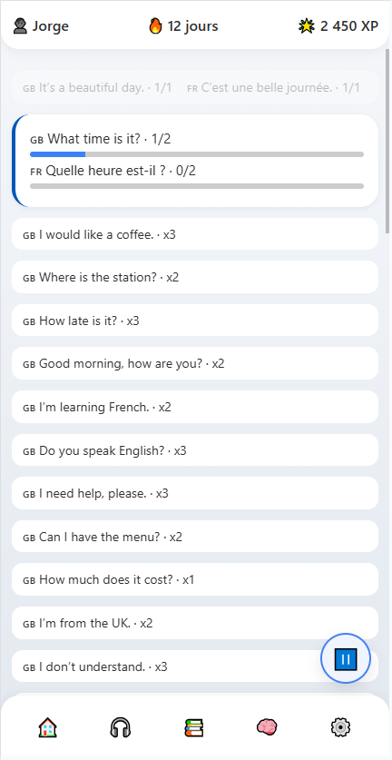
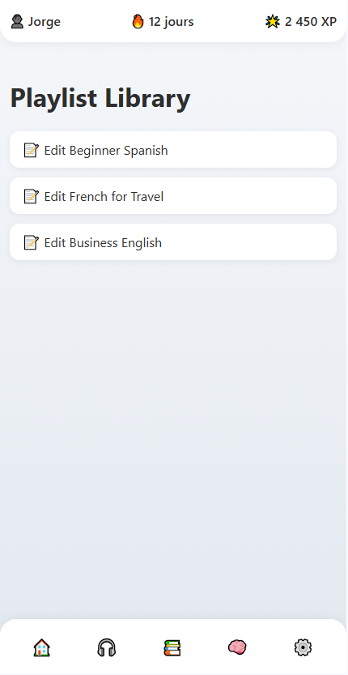

# Speakify – Cahier des Charges

## 1. Introduction  
### 1.1 Présentation du projet  
Speakify est une plateforme interactive d’apprentissage des langues qui permet aux utilisateurs d’interagir avec du contenu audio multilingue à travers des playlists structurées. Elle permet de créer et gérer des expériences audio personnalisées basées sur la traduction, rendant l’apprentissage plus immersif et efficace. Speakify est conçu pour être accessible sur mobile, ordinateur et téléviseur.

### 1.2 Objectifs  
- Proposer une approche structurée de l’apprentissage des langues via les **boucles de lecture (PLs)**.  
- Permettre aux utilisateurs de créer, gérer et personnaliser des **playlists** selon différents modes d’apprentissage.  
- Garantir une expérience fluide sur plusieurs types d’appareils.  
- Supporter plusieurs langues et traductions avec lecture audio.  
- Offrir un backend évolutif pour un stockage et une récupération efficaces des traductions.  
- Développer et déployer le projet entre le **25 mars et le 23 avril 2025**.

---

## 2. Fonctionnalités & Résolution de problèmes  

### **2.1 Fonctionnalités de l'application**  
- **Playlists audio multilingues** : les utilisateurs peuvent créer et personnaliser des playlists composées de boucles de lecture avec fichiers audio.  
- **Boucles de Lecture (PLs)** : unité structurée contenant une phrase dans une langue source et ses traductions, chacune avec un fichier audio associé.  
- **Schéma de lecture personnalisable** : l’utilisateur peut définir l’ordre de lecture, les répétitions, et le rythme.  
- **Compatibilité multi-appareils** : fonctionne sur mobile, ordinateur et téléviseur.  
- **Apprentissage interactif** : mode boucle, vitesse réglable, entraînement à la prononciation.  
- **Mode d’apprentissage intensif** : drills répétitifs avec vitesse accélérée et difficulté adaptative.  
- **Support hors-ligne** (prévu) : stockage local des traductions et audios.  
- **Gestion des playlists** : créer, modifier, organiser des sessions selon les besoins personnels.  
- **Playlists par difficulté et contexte** : vocabulaire professionnel, contextes spécifiques.  
- **Apprendre en déplacement** : pensé pour les utilisateurs actifs (transports, marche, travail).  
- **Support aux immigrés** : outil accessible pour l’intégration linguistique rapide.  
- **Extensions futures** : intégration potentielle avec services de traduction IA.  
- **Contrôle de pertinence des traductions** : possibilité d’ajuster la fréquence d’une traduction pendant la lecture.  
- **Schéma basé sur la pertinence** : prioriser ou réduire certaines traductions dans la lecture.  
- **Listes intelligentes** :  
  - **Listes par mot cible** : phrases avec un mot spécifique en contexte.  
  - **Listes de conjugaisons** : phrases avec un verbe décliné.  
  - **Listes contextuelles** : (ex : aéroport, hôpital, restaurant).  
  - **Phrases aléatoires** : diversité d’expressions.  
  - **Dialogues** : simulations conversationnelles.  
  - **Histoires** : apprentissage narratif.  
  - **Mot du jour** : un mot/phrase par jour avec exemples contextualisés.

### 2.2 Public cible  
- **Apprenants en langues**  
- **Enseignants & formateurs**  
- **Professionnels multilingues**  
- **Spécialistes métiers (médical, juridique, etc.)**  
- **Voyageurs et expatriés**  
- **Orthophonistes & chercheurs**  
- **Travailleurs pressés**  
- **Immigrants et nouveaux résidents**

---

## 3. Navigation & Maquettes  

### 3.1 Schéma de navigation utilisateur

```plaintext
Lancer l’application
   ↓
[🏠 Tableau de bord]
   ├── "Nouvelle session"        → [🎧 Lecteur]
   ├── "Playlist récente"        → [🎧 Lecteur]
   ├── "Mot du jour"             → [🧠 Listes intelligentes > Mot du jour]
   └── "Playlists"               → [📚 Bibliothèque de playlists]

[📚 Bibliothèque de playlists]
   ├── "Voir Playlist"          → [🎧 Lecteur]
   ├── "+ Créer Playlist"       → [✏️ Éditeur de Playlist]
   │     └── "Assigner Schéma"  → [🛠 Sélecteur de Schéma] ou [➕ Nouveau Schéma]
   └── "Modifier Schéma"        → [🛠 Éditeur de Schéma]

[🛠 Éditeur de Schéma]
   ├── Ordre de lecture (ex : EN → FR → Pause → Répéter)
   ├── Répétitions par segment
   ├── Délais / vitesses
   └── Enregistrer le schéma

[🧠 Listes intelligentes]
   ├── Mot du jour            → Phrases contextuelles
   ├── Conjugaisons           → Variations de verbes
   ├── Contextes thématiques  → Aéroport, Restaurant, etc.
   ├── Dialogues / Histoires  → Audio contextuel

[🎧 Lecteur]
   └── Contrôles : Lecture, Pause, Boucle, Suivant, Précédent, Vitesse

[⚙️ Paramètres]
   ├── Vitesse audio
   ├── Langues préférées
   └── Mode hors-ligne

[🔐 Connexion (optionnelle)]
   └── Sauvegarde profil, synchronisation cloud
```

---

### 3.2 Maquettes (Low-Fidelity)  
#### 🎧 **Vue Lecture**

```plaintext
┌──────────────────────────────────────────────┐
│ 👤 Jorge     🔥 12 jours     🌟 2 450 XP      │ ← En-tête
├──────────────────────────────────────────────┤
│ ▶ Hello (EN)      → Bonjour (FR)             │
│ ⏸ Pause   🔄 Répéter x3                      │ ← Phrase active
├──────────────────────────────────────────────┤
│ 🔽 Phrase 2 (FR)                             │
│ 🔽 Phrase 3 (FR)                             │ ← File d'attente
├──────────────────────────────────────────────┤
│ 🏠  🎧  📚  🧠  ⚙️                              │ ← Navigation
└──────────────────────────────────────────────┘
```

---

### 3.3 Écrans UI (Feuille de route MVP)

| Vue                   | Statut    | Description                                        |
|------------------------|-----------|----------------------------------------------------|
| Vue Lecture            | ✅ Terminé | Lecture audio avec séquence de traduction          |
| Vue Éditeur de Schéma  | 🔜 Bientôt | Création du schéma de lecture                     |
| Bibliothèque Playlists | 🔲 À faire | Parcours & gestion des playlists                  |
| Éditeur de Playlist    | 🔲 À faire | Création + assignation de schémas                 |
| Listes intelligentes   | 🔲 À faire | Générées automatiquement (verbes, contexte, etc.) |
| Paramètres             | 🔲 À faire | Langues, vitesses, hors-ligne                     |

---

### 🔮 Fonctionnalités Bonus (Prévu)

| Fonctionnalité               | Statut |
|------------------------------|--------|
| Vue "Mot du jour"            | 🔲     |
| Connexion & Profil utilisateur | 🔲     |
| Statistiques & Réussites     | 🔲     |
| Mode Hors-Ligne complet      | 🔲     |

---

## 4. Identité Graphique (UI/UX Design)

Speakify vise une expérience visuelle claire, immersive et cohérente sur tous les appareils. La charte graphique favorise la lisibilité, la concentration et l’engagement.

### 4.1 Palette de couleurs

| Usage            | Nom de Couleur     | Code Hex | Remarques                                       |
|------------------|--------------------|----------|-------------------------------------------------|
| Principal        | Bleu profond       | #0057B7  | Calme, confiance, concentration                 |
| Accentuation     | Vert électrique    | #00E676  | Boutons d'action (ex : lecture)                |
| Fond             | Gris clair         | #F5F7FA  | Repos visuel                                    |
| Surface cartes   | Blanc doux         | #FFFFFF  | Fonds des conteneurs                           |
| Texte principal  | Noir charbon       | #2E2E2E  | Lisibilité maximale                             |
| Alertes / erreurs| Rouge corail       | #FF5252  | Actions critiques                              |

### 4.2 Typographie

| Usage        | Police               | Alternatives                |
|--------------|----------------------|-----------------------------|
| Titres       | Segoe UI Bold        | system-ui, sans-serif       |
| Texte        | Segoe UI Regular     | Helvetica, Arial            |
| Highlights   | Antipasto Pro Light  | Segoe UI                    |

### 4.3 Composants & Mise en page

- **Boutons** : arrondis, contrastés, animés au survol  
- **Cartes** : ombres douces, marges homogènes  
- **Navigation** : en bas sur mobile, en haut ou à gauche sur desktop  
- **Icônes** : Lucide / Tabler / Material Symbols  
- **Animations** : légères transitions pour retours visuels  
- **Mode sombre** : prévu en option

### 4.4 Cohérence multi-écran

- 📱 **Mobiles** : navigation tactile, ergonomie pouce  
- 💻 **Ordinateurs** : mise à l’échelle des blocs  
- 📺 **TVs / Smart Displays** : texte large, contrastes élevés  

---

## 5. Éco-Responsabilité

Speakify intègre des principes numériques responsables pour réduire l’impact écologique.

### 5.1 Serveur & hébergement
- API optimisées, serveurs légers  
- Requêtes SQL paginées & mises en cache  
- Hébergeurs verts : Infomaniak, Scaleway Green  
- Infrastructure auto-scalable

### 5.2 Optimisation réseau
- Chargement différé des images et audios  
- Streaming adaptatif  
- Formats modernes (WebP, Brotli)  
- Moins de scripts tiers

### 5.3 Mode hors-ligne
- Cache local des TB et audios  
- Pré-chargement à la demande  
- Mode “conscient batterie” (prévu)

### 5.4 Améliorations futures
- Mode sombre OLED éco  
- Suivi analytique sobre  
- IA légère, exécution côté client

---

## 6. SEO & Visibilité

Speakify mettra en place une stratégie SEO complète pour atteindre les apprenants du monde entier.

### 6.1 SEO Technique & Contenu
- URL propres et localisées  
- Balises meta, titres, OG tags  
- Sitemap XML & robots.txt  
- Temps de chargement rapides  

### 6.2 Mots-Clés Ciblés

**Principaux mots-clés** :
- application apprentissage langues  
- immersion audio  
- écouter pour apprendre  
- apprendre le français en voiture  
- playlist de vocabulaire

**Mots-clés contextuels** :
- vocabulaire médical en espagnol  
- anglais quotidien pour immigrés  
- recherche vocale (“comment dire bonjour en japonais ?”)

### 6.3 Indexation multilingue
- Tags `hreflang`  
- Métadonnées localisées  
- URL par langue : `/fr`, `/en`, `/es`, etc.  
- Mapping sémantique international

### 6.4 Présence en ligne
- Réseaux sociaux : OG / Twitter Cards  
- Markup Schema.org  
- App Store Optimization (si wrapper)  
- Blog futur (contenu éducatif + trafic SEO)

---

## 7. Équipe & Méthodologie

Speakify est développé par une équipe agile, rapide, et polyvalente.

### 7.1 Rôles de l'équipe

| Rôle                 | Responsabilités                                              |
|----------------------|--------------------------------------------------------------|
| **Product Owner**    | Vision du produit, priorisation, validation                  |
| **Chef de projet**   | Organisation, jalons, coordination                           |
| **Lead Dev**         | Architecture, qualité, cohérence technique                   |
| **Frontend Dev**     | UI responsive, composants interactifs                        |
| **Backend Dev**      | Base de données, API, logique serveur                        |
| **UX/UI Designer**   | Prototypes, maquettes, identité visuelle                     |
| **QA Tester**        | Tests manuels/automatisés, stabilité                         |
| **Curateur de contenu** | Gestion du contenu multilingue, qualité linguistique     |
| **DevOps (optionnel)** | Déploiement, sync cloud, hébergement                      |

> *Plusieurs rôles peuvent être tenus par la même personne (ex : Jorge).*

### 7.2 Phases de projet

| Phase       | Dates              | Tâches principales                             |
|-------------|--------------------|-----------------------------------------------|
| **Phase 1** | 25–29 mars 2025    | Schéma DB, MCD                                 |
| **Phase 2** | 30 mars–5 avril    | Création API                                   |
| **Phase 3** | 6–12 avril         | UI Lecture, Schéma, Listes intelligentes       |
| **Phase 4** | 13–19 avril        | Tests, corrections, optimisation               |
| **Phase 5** | 20–23 avril        | Déploiement + Documentation finale             |

### 7.3 Méthodologie

- Sprints de 1 semaine  
- Stand-ups quotidiens (asynchrones possibles)  
- Planification / revue chaque semaine  
- Board Kanban : À faire → En cours → Revue → Terminé

**Outils** : GitHub, Trello, Notion, Figma, Slack/Discord, VS Code

---

## 8. Spécifications Techniques Intégrées (Exigence de Certification)

> Conformément aux exigences de certification, les spécifications techniques suivantes sont intégrées explicitement dans ce document.

### 8.1 Architecture Système

- **Frontend** : HTML, CSS, JS (ES6+), Bootstrap, AJAX  
- **Backend** : APIs PHP 8.x  
- **Base de données** : MySQL  
- **Structure** :
  - Le frontend récupère et affiche les playlists, schémas et blocs de traduction  
  - Le backend fournit les données dynamiquement via des endpoints API  
  - La base contient toutes les structures (langues, phrases, traductions, sources)

### 8.2 Schéma de base de données (prévisionnel)

- `languages` : langues disponibles avec ID/code/nom  
- `sentences` : phrases de base avec références langue  
- `translation_pairs` : association de deux phrases traduites  
- `sources` : origine de la traduction (manuel, API, etc.)  
- `translation_pair_sources` : lien entre une paire et sa source

### 8.3 Stack Technique

| Couche       | Technologie    | Notes                                 |
|--------------|----------------|----------------------------------------|
| Frontend     | HTML/CSS/JS    | PWA responsive, Bootstrap              |
| Backend      | PHP 8.x        | APIs REST                              |
| Base données | MySQL          | Schéma normalisé avec index            |
| Outils       | XAMPP          | Dév local : Apache + MySQL             |
| API externe  | OpenAI (prévu) | Traduction + Synthèse vocale (TTS)     |

### 8.4 Design API (prévu)

URL de base : `http://localhost/speakify/backend/api.php`

| Méthode | Endpoint            | Description                      |
|---------|---------------------|----------------------------------|
| GET     | ?action=playlists   | Récupérer les playlists          |
| GET     | ?action=schemas     | Récupérer les schémas            |
| GET     | ?action=tb&id=xx    | Récupérer un bloc de traduction  |
| POST    | TBD                 | Sauvegarder playlist/schéma      |

### 8.5 Sécurité

- MVP : pas encore de connexion utilisateur  
- À venir :
  - Authentification (JWT ou session)  
  - Droits d’accès aux playlists personnelles  
  - Sanitation des entrées API (prévention XSS/SQL)

### 8.6 Tests

| Type           | Description                                  |
|----------------|----------------------------------------------|
| Manuel         | Lecture, boucles, interactivité UI           |
| Unitaire       | API backend (PHPUnit prévu)                  |
| Frontend       | Lecture & logique (Jest/Cypress prévus)      |
| Multi-appareils| Tests mobile, desktop, TV                    |

---

## 9. Conclusion

Speakify est bien plus qu’une application d’apprentissage des langues : c’est une plateforme immersive, flexible et centrée sur l’utilisateur, conçue pour s’adapter aux besoins réels.

À tout moment — en déplacement, au bureau ou à la maison — les utilisateurs peuvent interagir avec du contenu multilingue de qualité, des playlists personnalisées, et des schémas de lecture dynamiques.

Ce document pose les fondations d’un outil linguistique puissant, évolutif vers de futures innovations comme la traduction IA ou l’interaction vocale.

**Prochaine étape** : finaliser les prototypes UI, consolider l’identité graphique, et optimiser les workflows pour une sortie réussie le **23 avril 2025**.

---

**Version du document** : 1.2.0  
**Date** : mars 2025  
**Auteur** : Jorge

---

# Speakify – Spécifications Techniques

- **Nom du projet** : Speakify  
- **Version** : 1.0.0  
- **Date** : mars 2025  
- **Auteur(s)** : Jorge

Speakify est une PWA multiplateforme conçue pour faciliter l’apprentissage immersif des langues à travers des playlists audio multilingues structurées. Elle s’appuie sur les **blocs de traduction (TB)** et des schémas de lecture personnalisés.

---

## 10. Architecture Système

### 10.1 Vue d’ensemble
- Frontend : HTML/CSS/JS (PWA dynamique)  
- Backend : APIs PHP  
- JSON : données simulées en phase dev  
- Base de données (prévue) : stockage structuré des traductions

### 10.2 Détails des composants

- **Frontend** :
  - HTML, CSS, Bootstrap, JS
  - Chargement AJAX des playlists / schémas
  - Interfaces : Lecture, Playlist, Listes Intelligentes

- **Backend** :
  - PHP (`api.php`)
  - Fournit les TB, schémas, playlists

- **Base de données** :
  - Schéma prévu avec tables pour langues, phrases, utilisateurs
  - Gestion des traductions manquantes
  - Contrôle de version

- **APIs externes** (prévu) :
  - OpenAI pour traduction et TTS

---

## 11. Stack Technologique

| Couche       | Technologie     | Version | Notes                              |
|--------------|------------------|---------|-------------------------------------|
| Frontend     | HTML/CSS/JS      | ES6+    | Interface responsive PWA            |
| Backend      | PHP              | 8.x     | Endpoints simples                   |
| Base de données | MySQL (prévu) | TBD     | Modèle structuré                    |
| APIs         | OpenAI (prévu)   | N/A     | Traduction & synthèse vocale        |
| DevOps       | XAMPP / Manuel   | N/A     | Dev local                           |
| Autres       | JSON             | N/A     | Données simulées côté dev           |

---

## 12. Modèles de données

### 12.1 Schéma de base de données

- Tables prévues :
  - `languages`
  - `sentences`
  - `translation_pairs`
  - `sources`
  - `translation_pair_sources`

### 12.2 Exemple de JSON

```json
{
  "playlist_id": "123",
  "name": "Français de base",
  "blocks": [
    {
      "tb_id": "456",
      "text_source": "Hello",
      "text_translation": "Bonjour",
      "audio_source": "hello_en.mp3",
      "audio_translation": "bonjour_fr.mp3"
    }
  ]
}
```

---

## 13. Endpoints API

URL de base : `http://localhost/speakify/backend/api.php`

| Méthode | Endpoint          | Description                     | Auth | Paramètres             |
|---------|-------------------|----------------------------------|------|-------------------------|
| GET     | ?action=playlists | Récupère toutes les playlists    | Non  |                         |
| GET     | ?action=schemas   | Récupère tous les schémas        | Non  |                         |
| GET     | ?action=tb&id=xxx | Récupère un bloc de traduction   | Non  | `id`                    |
| POST    | TBD               | Crée/modifie une playlist        | Oui  | `playlist`, `schema`    |

---

## 14. Logique Métier & Comportement

- Lecture selon le schéma utilisateur : ordre, répétitions, pauses  
- Parcours des TB dans une playlist  
- Chaque TB = phrase source + une ou plusieurs traductions avec audio  
- Listes intelligentes générées automatiquement  
- Une boucle active à la fois  
- Boucles ouvertes → barres de progression, texte visible  
- Boucles fermées → résumé sur une ligne  
- Bouton lecture global flottant (en bas à droite)  
- Les données sont chargées dynamiquement depuis `data/translations.json`

---

## 15. Sécurité

- MVP : pas d’authentification  
- À venir :
  - Connexion utilisateur (JWT ou session)  
  - Droits d’accès aux playlists personnelles  
  - Validation & sanitation des entrées API

---

## 16. Structure UI

| Vue / Page         | Description                          | Fichier associé                 |
|--------------------|--------------------------------------|----------------------------------|
| Tableau de bord    | Accès rapide aux vues principales    | dashboard.html                   |
| Lecteur            | Interface de lecture                 | playback.html                    |
| Bibliothèque       | Liste des playlists                  | playlist-library.html            |
| Éditeur playlist   | Création / modification              | playlist-editor.html             |
| Listes intelligentes| Listes générées par contexte        | smart-lists.html                 |
| Éditeur de schéma  | Gestion des logiques de lecture      | schema-editor.html               |
| Paramètres         | Préférences utilisateur              | settings.html                    |
| Réussites/Stats    | Suivi progression                    | achievements.html                |
| Connexion/Profil   | Authentification (optionnelle)       | login-profile.html               |
| Mode hors-ligne    | Gestion locale                       | offline-mode.html                |

> Chaque page HTML doit avoir un `<head>` cohérent, une `.header`, une `.content`, une `.footer-nav`.

---

## 17. Environnements

| Environnement | URL                          | Remarques                      |
|---------------|-------------------------------|-------------------------------|
| Local         | http://localhost/speakify/    | XAMPP                          |
| Staging       | À définir                     | Préproduction / QA            |
| Production    | À définir                     | Déploiement final              |

---

## 18. Plan de Test

- Tests manuels :
  - Lecture, progression des boucles, navigation  
- Prévu :
  - Tests unitaires backend (PHPUnit)  
  - Validation frontend (Jest / Cypress)  
- Tests multi-écrans : mobile, desktop, TV

---

## 19. Performance & Contraintes

- Responsive design orienté mobile  
- Navigation fixe bas écran  
- Contenu AJAXisé (non codé en dur)  
- Chargement différé des audios  
- Une seule boucle ouverte  
- Contrôles flottants  
- Design unifié et léger

---

## 20. Annexes

- Exemples JSON : `playlists.json`, `schemas.json`, `translations.json`  
- Glossaire :
  - TB = Bloc de Traduction  
  - PL = Boucle de Lecture  
  - Schéma = logique de séquence  
- Services externes :
  - API OpenAI (prévue)  
  - Traduction & TTS  
- Organisation des fichiers :
  - Dossier principal : `speakify/model/`  
  - Script principal : `script.js`  
  - Feuille de style globale : `style.css`

---

## Annexe A : Captures d'écran

### A.1 Vue Tableau de bord


---

### A.2 Vue Lecture



---

### A.3 Vue Playlists


```

---

