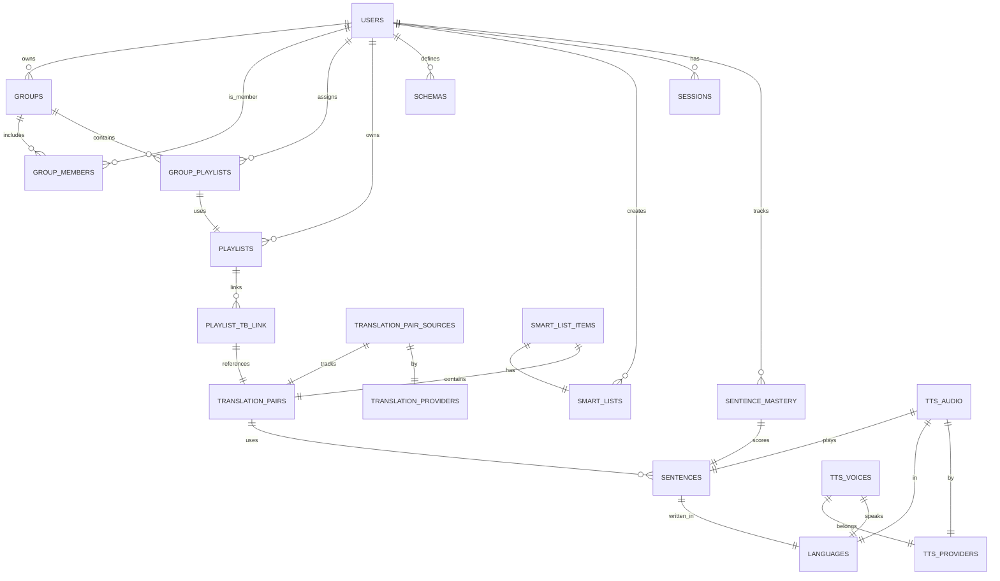

```mermaid
erDiagram
    USERS ||--o{ GROUPS : owns
    USERS ||--o{ GROUP_MEMBERS : is_member
    USERS ||--o{ GROUP_PLAYLISTS : assigns
    USERS ||--o{ PLAYLISTS : owns
    USERS ||--o{ SCHEMAS : defines
    USERS ||--o{ SMART_LISTS : creates
    USERS ||--o{ SESSIONS : has
    USERS ||--o{ SENTENCE_MASTERY : tracks

    GROUPS ||--o{ GROUP_MEMBERS : includes
    GROUPS ||--o{ GROUP_PLAYLISTS : contains
    GROUP_PLAYLISTS ||--|| PLAYLISTS : uses
    PLAYLISTS ||--o{ PLAYLIST_TB_LINK : links
    PLAYLIST_TB_LINK ||--|| TRANSLATION_PAIRS : references

    TRANSLATION_PAIRS ||--o{ SENTENCES : uses
    TRANSLATION_PAIR_SOURCES ||--|| TRANSLATION_PAIRS : tracks
    TRANSLATION_PAIR_SOURCES ||--|| TRANSLATION_PROVIDERS : by

    SMART_LIST_ITEMS ||--|| SMART_LISTS : has
    SMART_LIST_ITEMS ||--|| TRANSLATION_PAIRS : contains

    SENTENCE_MASTERY ||--|| SENTENCES : scores

    TTS_AUDIO ||--|| SENTENCES : plays
    TTS_AUDIO ||--|| LANGUAGES : in
    TTS_AUDIO ||--|| TTS_PROVIDERS : by

    TTS_VOICES ||--|| TTS_PROVIDERS : belongs
    TTS_VOICES ||--|| LANGUAGES : speaks

    SENTENCES ||--|| LANGUAGES : written_in
```