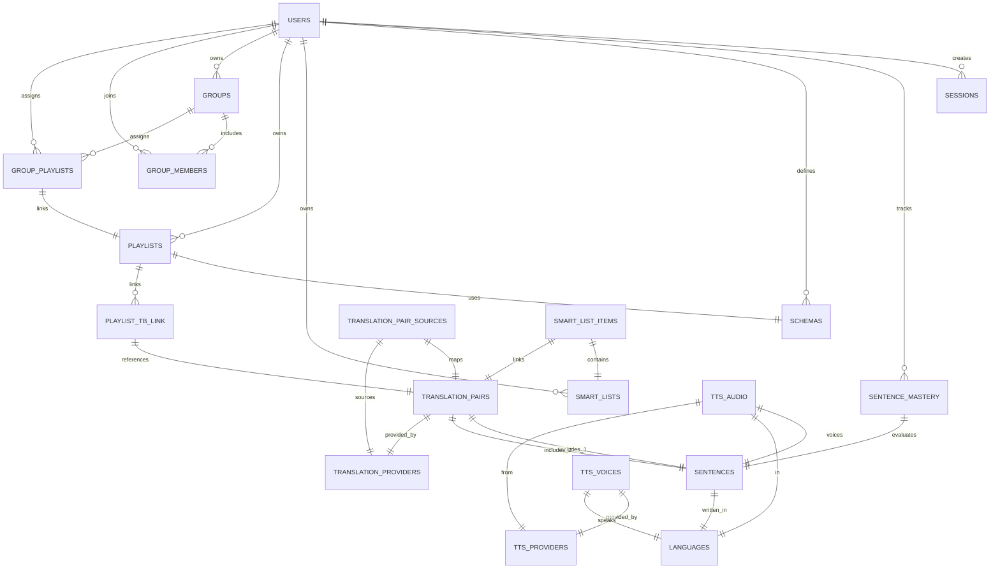

```mermaid
erDiagram

%% ===========================
%% USERS & SESSIONS
%% ===========================
    USERS ||--o{ SESSIONS : creates
    USERS ||--o{ SENTENCE_MASTERY : tracks
    USERS ||--o{ SCHEMAS : defines
    USERS ||--o{ SMART_LISTS : owns
    USERS ||--o{ PLAYLISTS : owns
    USERS ||--o{ GROUPS : owns
    USERS ||--o{ GROUP_MEMBERS : joins
    USERS ||--o{ GROUP_PLAYLISTS : assigns

%% ===========================
%% GROUPS & COLLABORATION
%% ===========================
    GROUPS ||--o{ GROUP_MEMBERS : includes
    GROUPS ||--o{ GROUP_PLAYLISTS : assigns
    GROUP_PLAYLISTS ||--|| PLAYLISTS : links

%% ===========================
%% PLAYLISTS & SCHEMAS
%% ===========================
    PLAYLISTS ||--|| SCHEMAS : uses
    PLAYLISTS ||--o{ PLAYLIST_TB_LINK : links
    PLAYLIST_TB_LINK ||--|| TRANSLATION_PAIRS : references

%% ===========================
%% SENTENCES & TRANSLATIONS
%% ===========================
    TRANSLATION_PAIRS ||--|| SENTENCES : includes_1
    TRANSLATION_PAIRS ||--|| SENTENCES : includes_2
    TRANSLATION_PAIRS ||--|| TRANSLATION_PROVIDERS : provided_by
    TRANSLATION_PAIR_SOURCES ||--|| TRANSLATION_PAIRS : maps
    TRANSLATION_PAIR_SOURCES ||--|| TRANSLATION_PROVIDERS : sources
    SENTENCES ||--|| LANGUAGES : written_in

%% ===========================
%% SMART LISTS
%% ===========================
    SMART_LIST_ITEMS ||--|| SMART_LISTS : contains
    SMART_LIST_ITEMS ||--|| TRANSLATION_PAIRS : links

%% ===========================
%% TTS AUDIO SYSTEM
%% ===========================
    TTS_AUDIO ||--|| SENTENCES : voices
    TTS_AUDIO ||--|| LANGUAGES : in
    TTS_AUDIO ||--|| TTS_PROVIDERS : from
    TTS_VOICES ||--|| TTS_PROVIDERS : provided_by
    TTS_VOICES ||--|| LANGUAGES : speaks

%% ===========================
%% PROGRESS TRACKING
%% ===========================
    SENTENCE_MASTERY ||--|| SENTENCES : evaluates
```